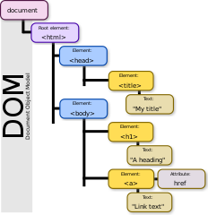

# Leaflet - acceso al DOM y manejo de eventos

## El Document Object Model (DOM)
El [*Document Object Model* (DOM)](https://developer.mozilla.org/en-US/docs/Web/API/Document_Object_Model) es una representación jerárquica de los objetos que componen una página web. Es también una interfaz de programación que brinda acceso para leer y modificar los elementos, atributos, estilos y eventos de un documento HTML.

La estructura jerárquica del DOM se ilustra en la figura 1.

<p>
  <figure>
    
    <figcaption>
      <small>
        <strong>Figura 1.</strong> El Document Object Model (DOM). Fuente: <a href="https://commons.wikimedia.org/wiki/File:DOM-model.svg">Birger Eriksson</a>.
      </small>
    </figcaption>
  </figure>  
<p>
  
### Eventos
Los nodos (i.e. elementos HTML) del DOM pueden estar asociados con [eventos](https://developer.mozilla.org/en-US/docs/Web/Events). Los eventos son acciones que se activan con la ocurrencia de sucesos como, por ejemplo, terminar la carga de una página web, llenar un campo de entrada de datos o presionar un botón. Por ejemplo:
  
```html
<button type="button" onclick="alert('¡Hola mundo!');">
    Hola mundo
</button>
```

### Ejemplo de acceso al DOM y manejo de eventos mediante JavaScript
1. Observe el [ejemplo en CodePen](https://codepen.io/mfvargas/pen/rzKggx).  
2. Si es necesario, [abra una cuenta gratuita en CodePen](https://codepen.io/accounts/signup/user/free).  
3. Realice un *fork* del *pen* hacia su cuenta.  
4. Ejecute el código y observe los resultados.

  
