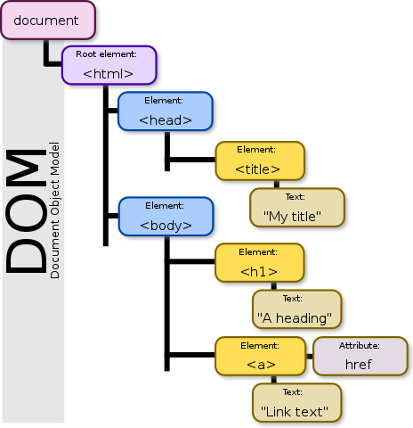

# Leaflet - acceso al DOM y manejo de eventos

## El *Document Object Model* (DOM)
El [*Document Object Model* (DOM)](https://developer.mozilla.org/en-US/docs/Web/API/Document_Object_Model) es una representación jerárquica de los objetos que componen una página web. Es también una interfaz de programación que permite que un programador tenga acceso para leer y modificar los elementos, atributos, estilos y eventos de un documento HTML.

La estructura jerárquica del DOM se ilustra en la figura 1.

  <figure>
    
    <figcaption>
      <small>
        <strong>Figura 1.</strong> El Document Object Model (DOM). Fuente: <a href="https://commons.wikimedia.org/wiki/File:DOM-model.svg">Birger Eriksson</a>.
      </small>
    </figcaption>
  </figure>  

